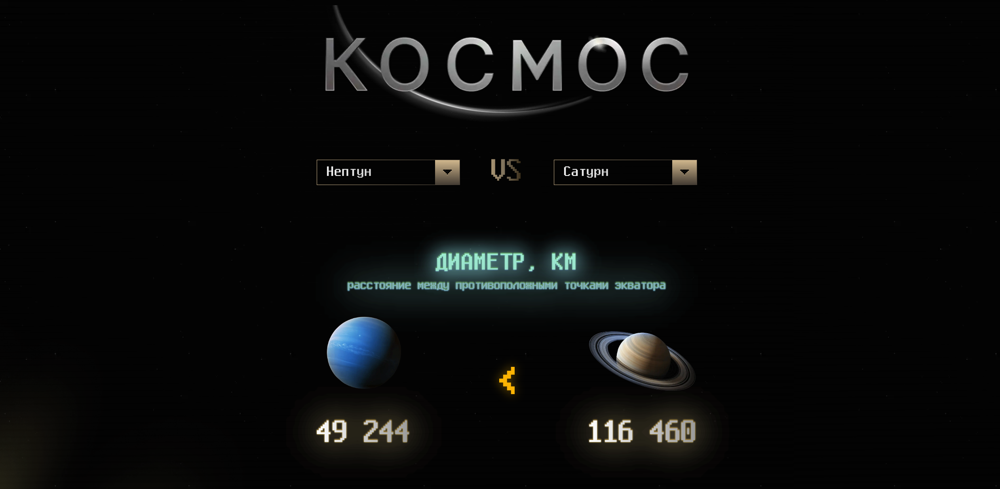
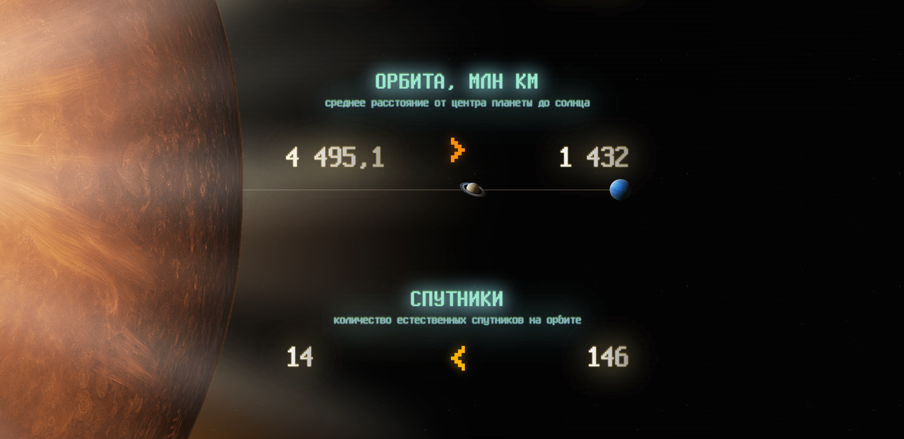

# КОСМОС: Интерактивное сравнение планет ✨🚀
**✨ Демо:** [https://zilusion.github.io/space/](https://zilusion.github.io/space/) ✨


Интерактивный одностраничный сайт для визуального сравнения характеристик планет Солнечной системы. Проект выполнен в рамках тестового задания с упором на fluid-дизайн, интерактивность и креативную визуализацию данных.



---

## 🛠️ Технологии
- **Svelte / SvelteKit:** Основа приложения. Выбран для изучения и применения компонентного подхода.
- **HTML5:** Семантическая разметка.
- **SCSS:** Для написания стилей.
- **JavaScript:** Логика компонентов, анимации.
---

## 🤔 Почему Svelte?

Я решил использовать Svelte для этого задания, хотя он и не был строго обязателен. Основная причина — **желание изучить его**.

Вторая причина — реализация такого количества интерактивных и визуально различных секций сравнения (диаметр, масса, температура, орбита, гравитация и т.д.) будет значительно **удобнее и структурированнее с использованием компонентного подхода**, который предоставляет Svelte. Управление состоянием (выбранные планеты) и реактивное обновление интерфейса также являются сильными сторонами фреймворка, что упростило разработку "живого" интерфейса по сравнению с ручной манипуляцией DOM в Vanilla JS.

---

## ✨ Реализованные Сравнения и Визуализации

- **Выбор Планет:** Два кастомных, доступных селектора, исключающих дублирование выбора.
- **Диаметр:** Отображение изображений планет, масштабированных пропорционально их реальному диаметру.
- **Гравитация:** Анимированная визуализация высоты прыжка условного "прыгуна" на каждой планете. Анимация запускается при наведении курсора на блок визуализации. Высота прыжка обратно пропорциональна гравитации.
- **Температура:** Отображение соответствующих иконок-эмодзи в зависимости от диапазона температур.
- **Масса:** Визуализация относительной массы с помощью иконок Земли. При большом количестве иконок (например, для Юпитера) динамически изменяется количество колонок и размер иконок для сохранения наглядности.
- **Орбита:** Отображение планет на общей стилизованной линии, имитирующей их относительное расстояние от Солнца. Позиция на линии рассчитывается пропорционально реальной орбите.
- **Спутники:** Стандартное числовое сравнение.
- **Год:** Стандартное числовое сравнение.

---

## ⚙️ Запуск Локально

1.  **Клонировать репозиторий:**
    ```bash
    git clone https://github.com/Zilusion/space.git
    cd space
    ```
2.  **Установить зависимости:**
    ```bash
    npm install
    ```
3.  **Запустить сервер разработки:**

    ```bash
    npm run dev
    ```

    Приложение будет доступно по адресу `http://localhost:5173` (или другому порту, если этот занят).

4.  **Сборка для продакшена (статика):**
    ```bash
    # Пример для GitHub Pages (замени <repo-name> при необходимости)
    $env:BASE_PATH="/space"; npm run build
    ```
    Результат будет в папке `build`.

---

